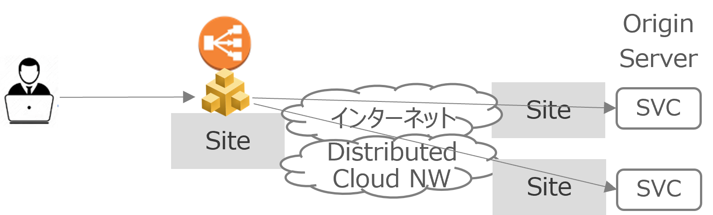
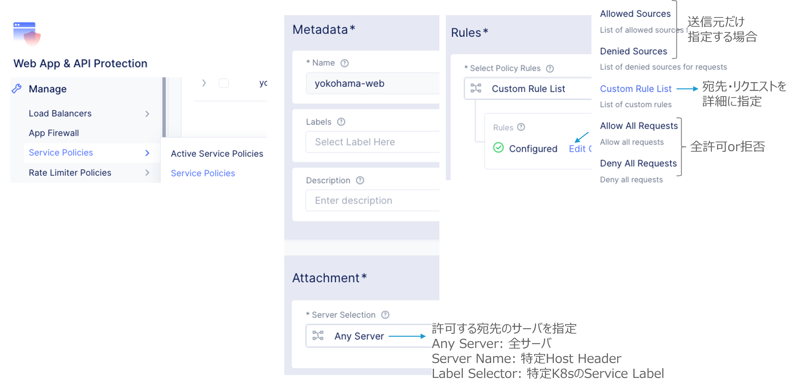
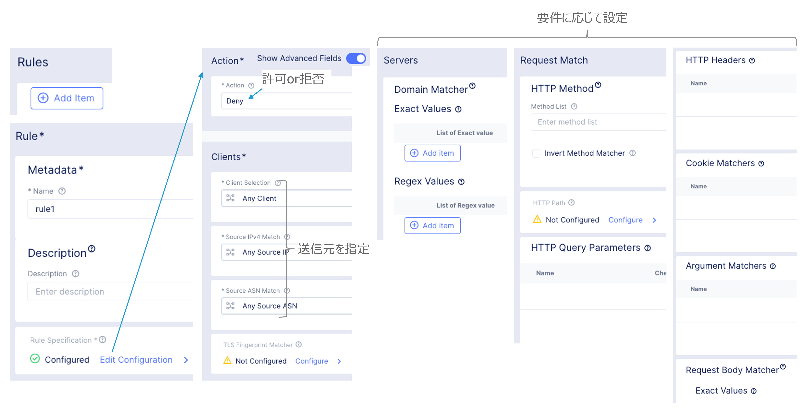
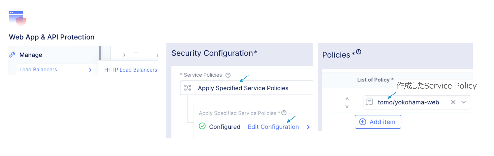
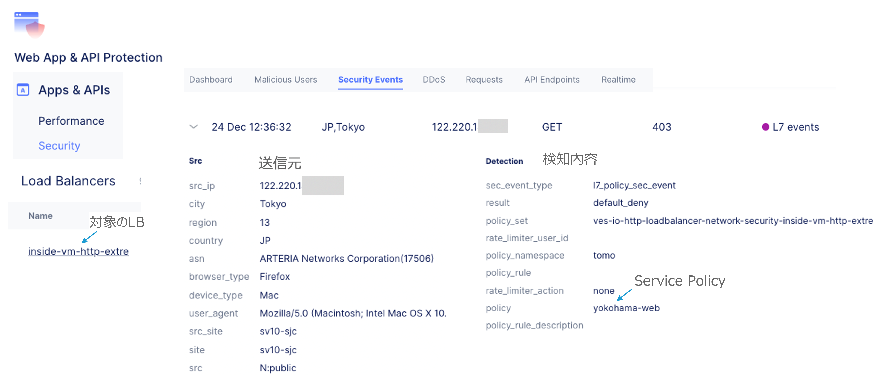

==============================================
Service Policy
==============================================

HTTP LBのVIPに対するL7アクセス制御
==================

送信元の指定

.. list-table::
    :header-rows: 1
    :stub-columns: 0

    * - 送信元
      - 説明
    * - IPv4 Prefix
      - 指定のネットワークアドレスからのアクセス
    * - BGP ASN  
      - 特定のAS番号からのアクセス
    * - Country List 
      - 特定の国を指定（実態はグローバルIPアドレス）

    * - Rate Limiting
      - | HTTP LB VIPに対するレートリミット。
        | 送信元の識別子：IP Prefix、ASN、HTTP Cookie、HTTP Header Name等。
        | レートリミットの対象：特定のHTTPメソッド、Domain、パス、ヘッダー等。
    * - Client Blocking
      - 特定の送信元のIP PrefixまたはASNをブロック。

宛先・リクエストの指定

.. list-table::
    :header-rows: 1
    :stub-columns: 0

    * - 宛先
      - 
      - 説明
    * - Server
      - Domain Matcher
      - ドメイン名を指定。完全一致または正規表現。
    * - Request
      - HTTP Method
      - メソッドとHTTPパス。Get, Put, Post等。
    * - 
      - HTTP Query Parameters
      - クエリ文字列。?query=udp等。
    * - 
      - HTTP Headers
      - ヘッダ。User-Agent: Mozilla/4.0等。
    * - 
      - Cookie Matcher
      - Session-id=12345等
    * - 
      - Body Matcher
      - Request Body String。

Service PolicyでRuleを定義
==================

.. image:: ../content06/images/image-06-02.png
  :width: 1080

Service PolicyでRuleを定義（Custom Rule List）
==================

Service PolicyをActiveにする
==================

Service PolicyをActiveにする
==================

==============================================
HTTP LoadBalancer
==============================================

Service PolicyをHTTP LBで指定。
==================

==============================================
Service Policy イベント検知
==============================================

