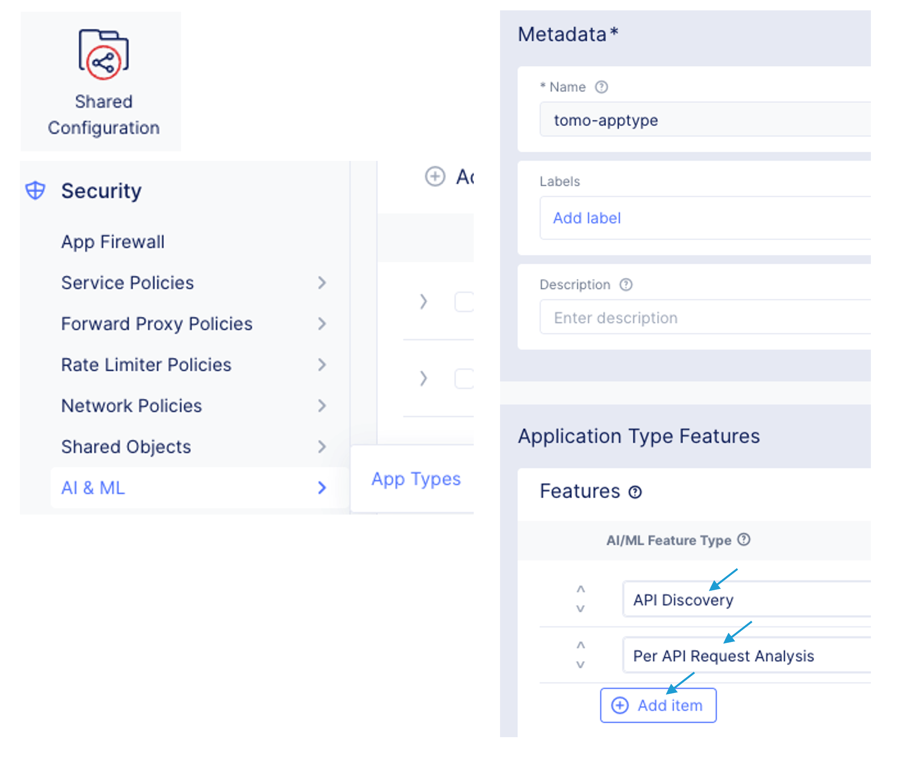
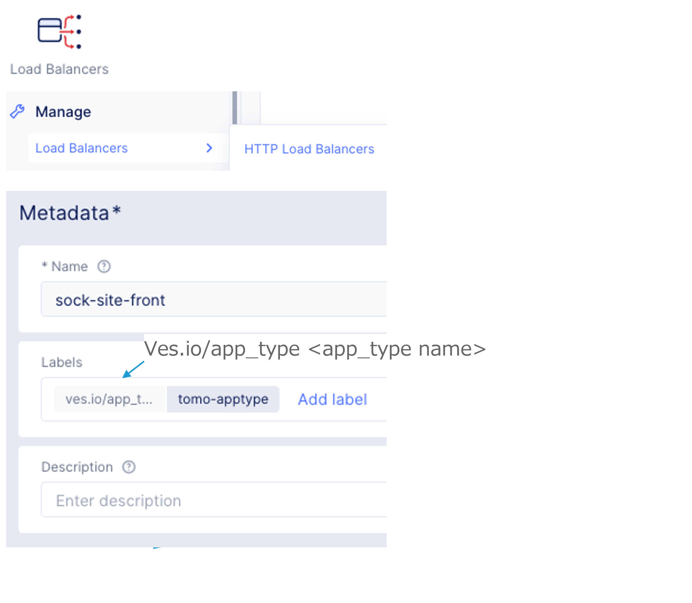
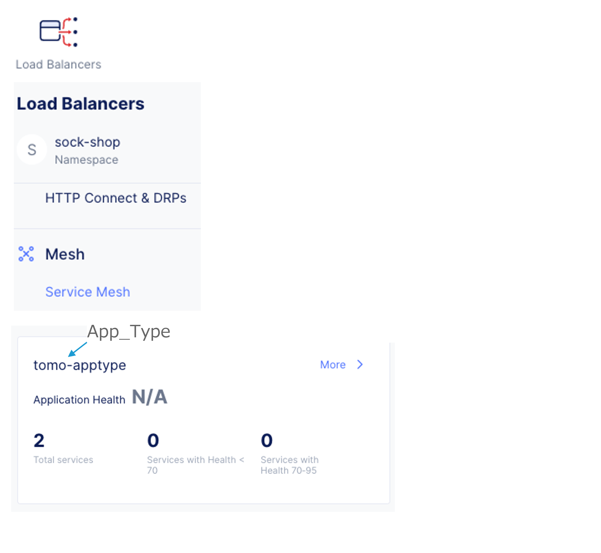
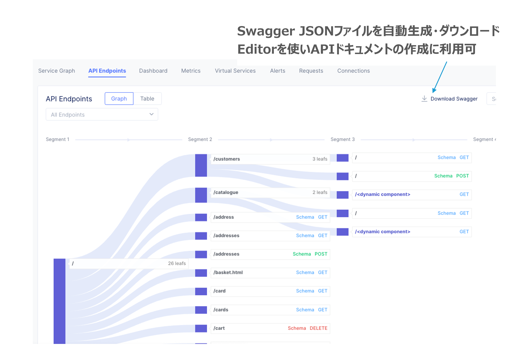
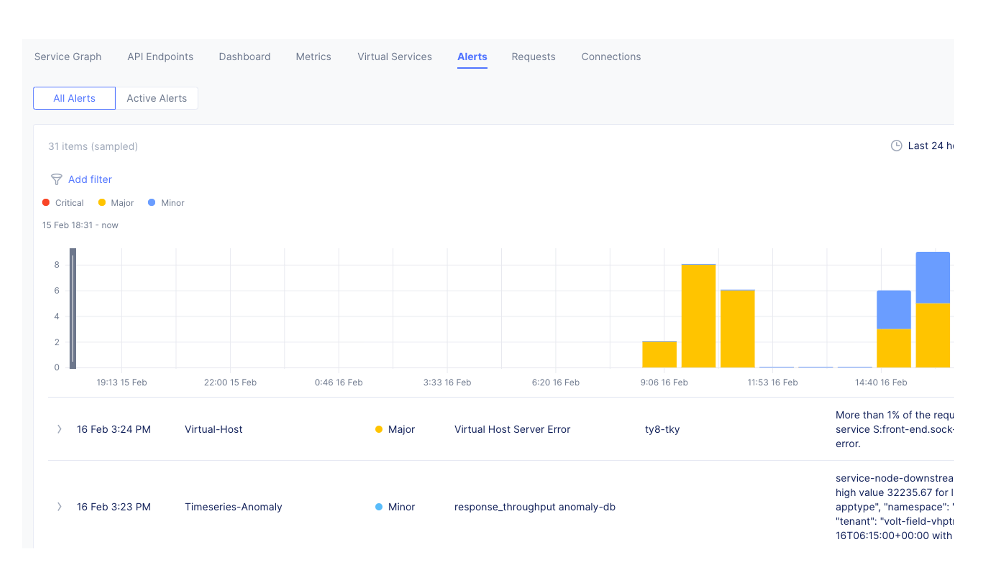

==============================================
API security and Anomaly detection
==============================================

App Type定義
==================

App TypeをLBに設定
==================

____

サービス間のAPI連携、スキーマ構造を学習し可視化
==================

リクエスト、エラーレート、遅延等をモニター

____

リクエスト・レスポンスサイズ、受信遅延値、リクエスト・エラーレートの異常検知

