==============================================
DDoS
==============================================

HTTP LBのVIPへのDDoS攻撃を防御。

.. list-table::
    :header-rows: 1
    :stub-columns: 0

    * - 手法
      - 説明
    * - Javascript Challenge
      - JavaScriptによる問い合わせを送り、ブラウザかどうかを識別
    * - Captcha Challenge  
      - 応答者がボットではなく人であることを確認
    * - Policy Based Challenge 
      - MLでユーザの挙動を学習しBlock/Javascript/Captchaチャレンジを適用
    * - Rate Limiting
      - HTTP LB VIPに対するレートリミット。送信元の識別子：IP Prefix、ASN、HTTP Cookie、HTTP Header Name等。レートリミットの対象：特定のHTTPメソッド、Domain、パス、ヘッダー等。|
    * - Client Blocking
      - 特定の送信元のIP PrefixまたはASNをブロック。
      

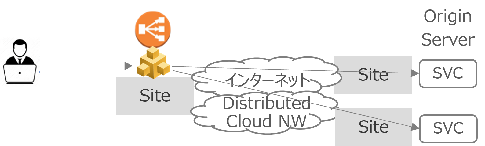

Javascript Challenge
==================

JavaScriptによる問い合わせを送り、ブラウザーかどうかを識別。
ブラウザと識別された場合、レスポンスにCookieを挿入して、次回以降のリクエストでは問い合わせない。

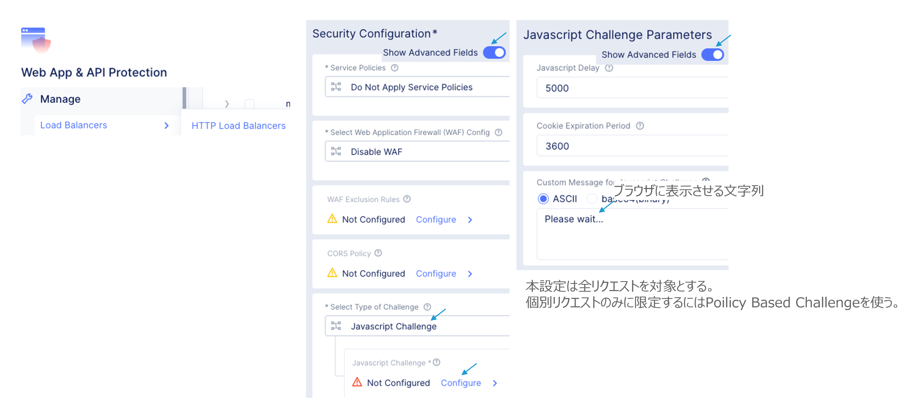

Captcha Challenge
==================

指定したイメージを選択させ、クライアントがBotではなく人であることを確認。

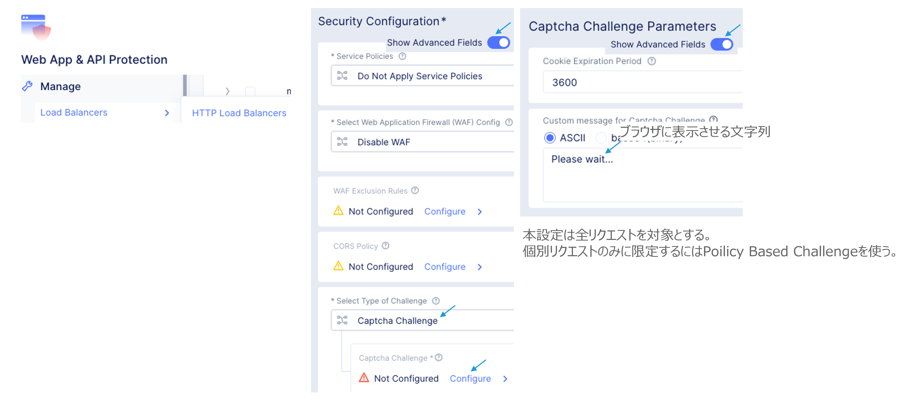

Policy Based Challenge - ML
==================

ML（機械学習）でMaliciousユーザを脅威3レベルに分類。各レベル毎にアクションを指定。

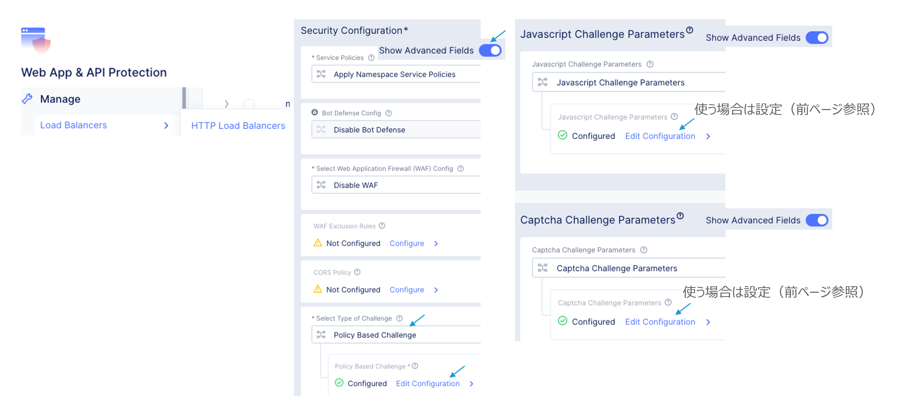

____

脅威レベル毎のアクションを変更。

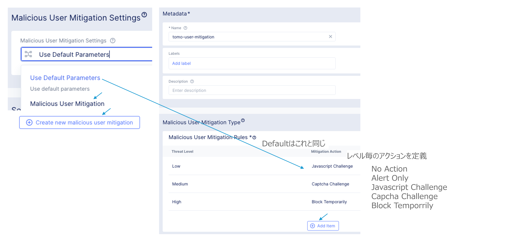

____

ユーザ識別子の変更。デフォルトではMaliciousユーザ=クライアントIPアドレス。

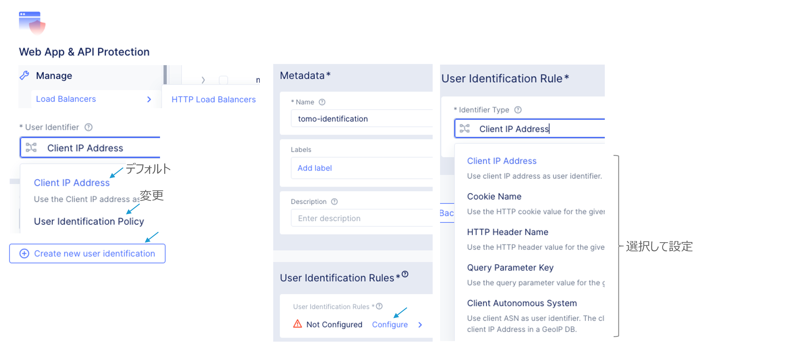

____

MLを有効にする。

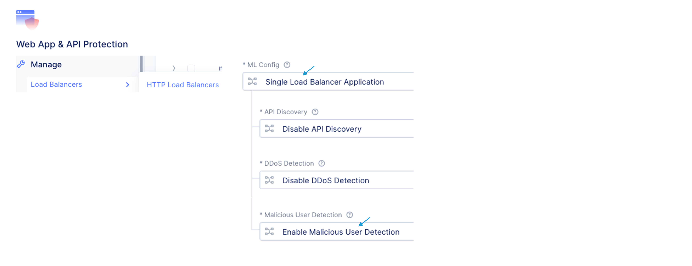

Maliciousユーザ検知 - ML
==================

.. image:: ../content08/images/image-08-08.png
  :width: 640

Policy Based Challenge - Static
==================

MLではなく送信元や宛先指定でアクションを決める。

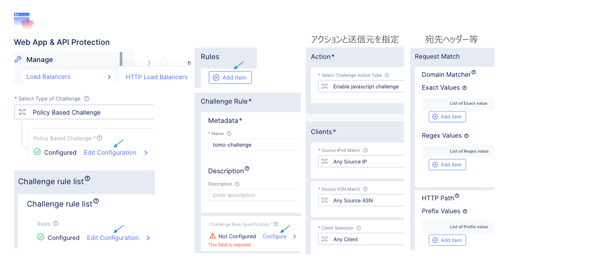

Rate Limiting
==================

HTTP LB VIPに対するレートリミット。 
送信元の識別子：IP Prefix、ASN、HTTP Cookie、HTTP Header Name等。
レートリミットの対象：特定のHTTPメソッド、Domain、パス、ヘッダー等。

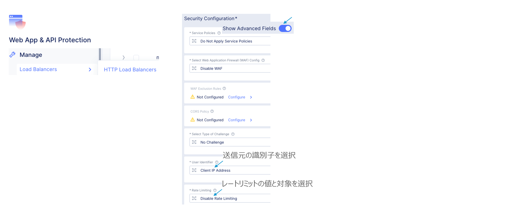

____

送信元の識別子を選択。

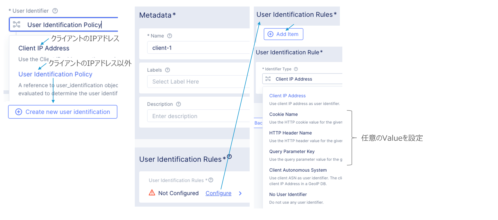

____

レートリミットの値と対象を選択。

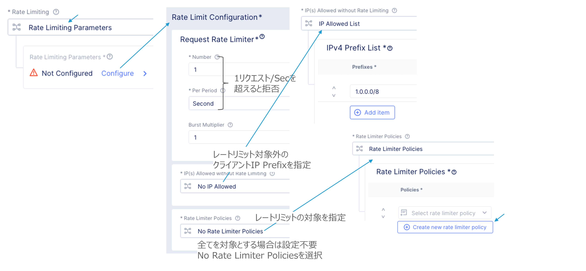

____

レートリミットの対象を選択。

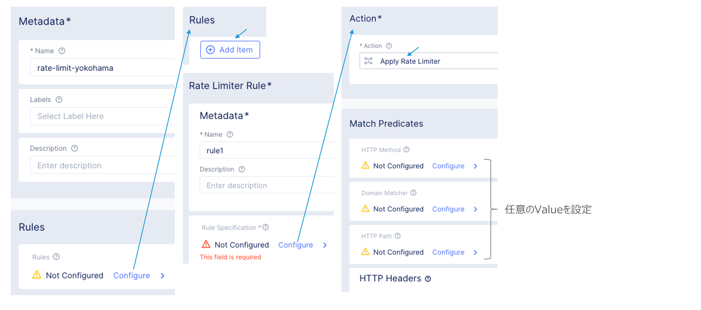

Client Blocking
==================

特定の送信元のIP PrefixまたはASNをブロック。

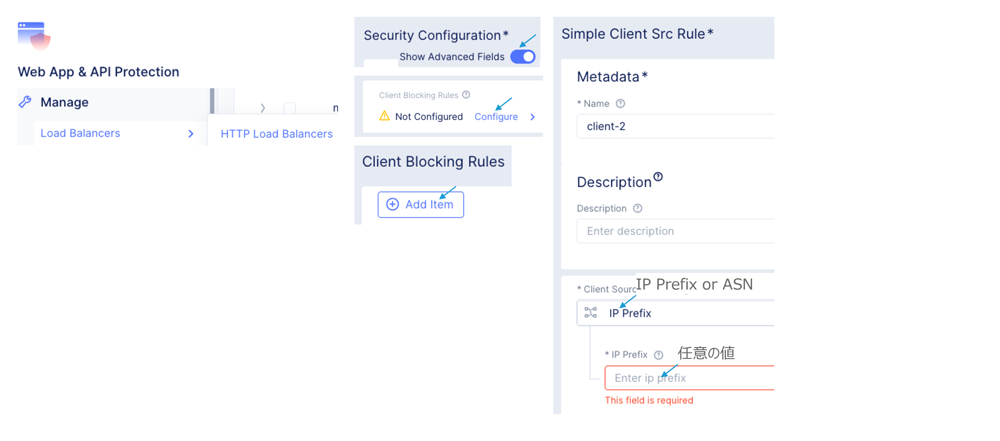

