==============================================
DDoS
==============================================

HTTP LBのVIPへのDDoS攻撃を防御。

+------------------------+--------------------------------------------------------------+
|手法                  　|説明                                                           |
+========================+=================+============================================+
|Javascript Challenge    |JavaScriptによる問い合わせを送り、ブラウザかどうかを識別          |
+------------------------+--------------------------------------------------------------+
|Captcha Challenge       |応答者がボットではなく人であることを確認                         |
+------------------------+--------------------------------------------------------------+
|Policy Based Challenge  |MLでユーザの挙動を学習しBlock/Javascript/Captchaチャレンジを適用 |
+------------------------+--------------------------------------------------------------+
|Rate Limiting           |HTTP LB VIPに対するレートリミット。                             |
+------------------------+--------------------------------------------------------------+
|Client Blocking         |特定の送信元のIP PrefixまたはASNをブロック。                     |
+------------------------+--------------------------------------------------------------+

|枠を   | つけても |
|-------|----------|
|意味は | 同じです |

HTTP LBのVIPに対するL7アクセス制御
==================

宛先・リクエストの指定

+-------+----------------------+--------------------------------------------+
|宛先 　|　                    |説明                                        |
+=======+======================+============================================+
|Server |Domain Matcher        |ドメイン名を指定。完全一致または正規表現。  |
+-------+----------------------+--------------------------------------------+
|Request|HTTP Method           |メソッドとHTTPパス。Get, Put, Post等。      |
+-------+----------------------+--------------------------------------------+
|       |HTTP Query Parameters |クエリ文字列。?query=udp等。                |
+-------+----------------------+--------------------------------------------+
|       |HTTP Headers          |ヘッダ。User-Agent: Mozilla/4.0等。         |
+-------+----------------------+--------------------------------------------+
|       |Cookie Matcher        |Session-id=12345等                          |
+-------+----------------------+--------------------------------------------+
|       |Body Matcher          |Request Body String。                       |
+-------+----------------------+--------------------------------------------+

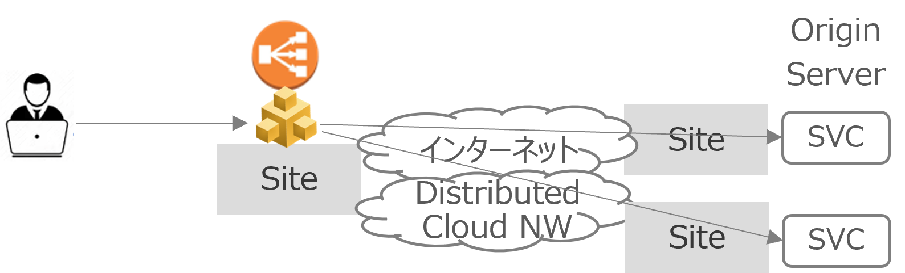

Service PolicyでRuleを定義
==================

**Web App & API Protection** を選択

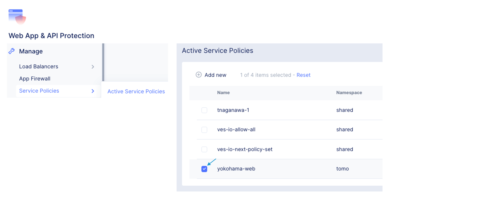

____

**Manage** > **Service Policies** > **Service Policies** を選択

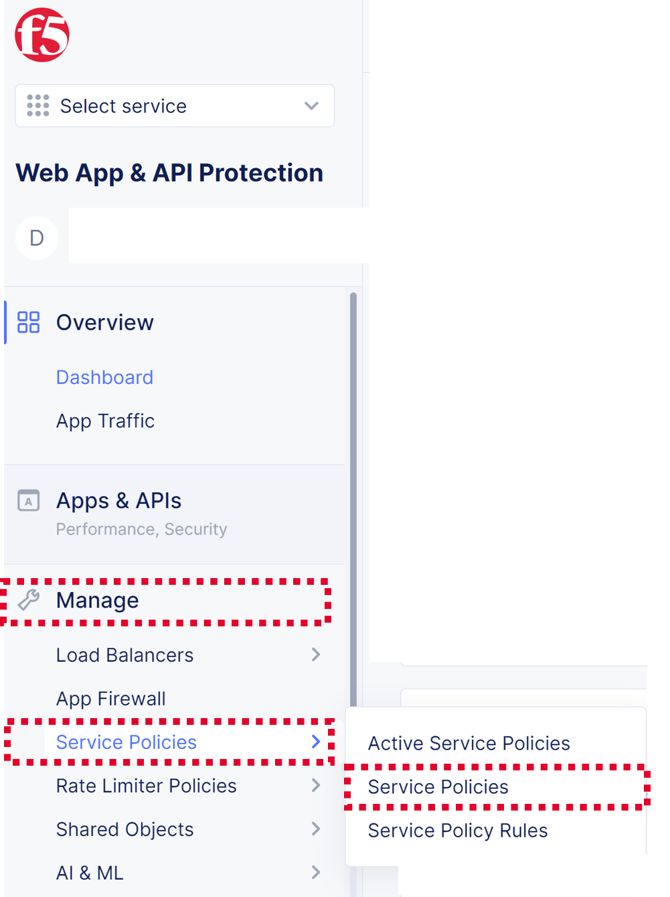

____

\ ``Add service policy`` \ を押下

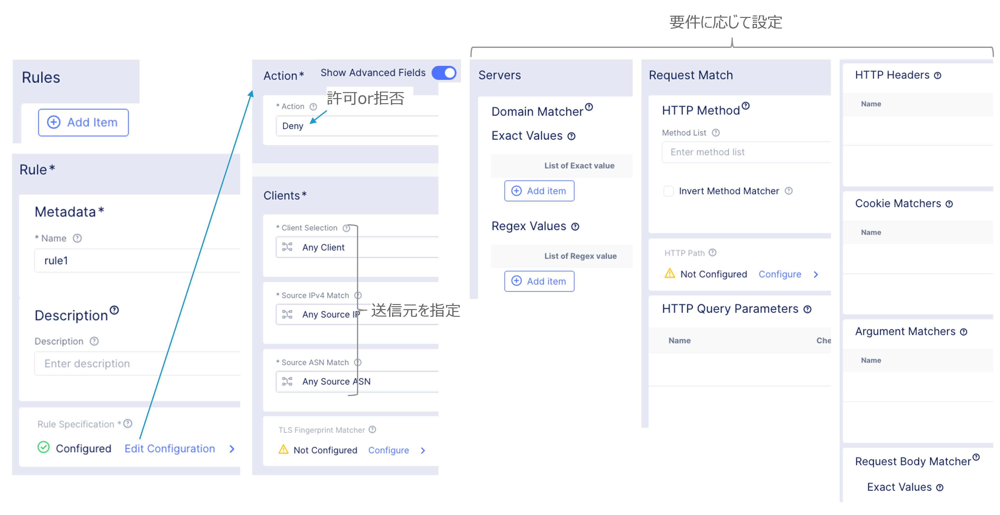

____

設定内容の入力

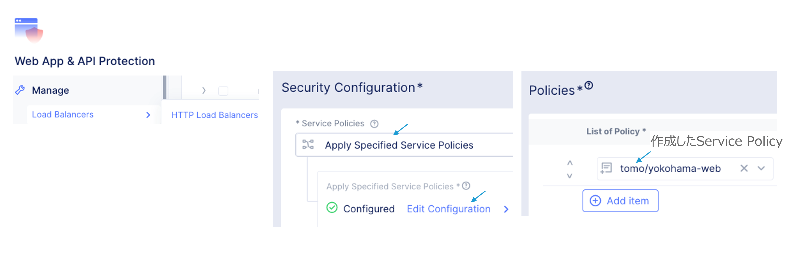

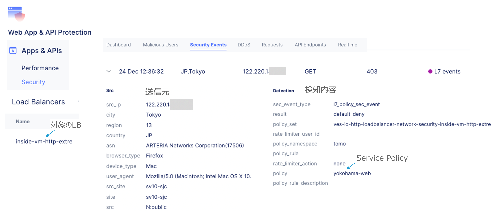

____

\ ``Configure`` \ を押下

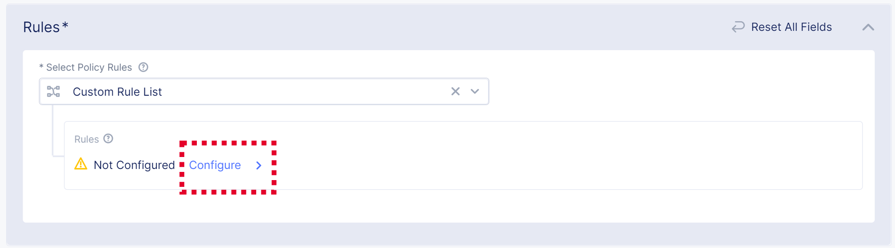

____

\ ``Add Item`` \ を押下

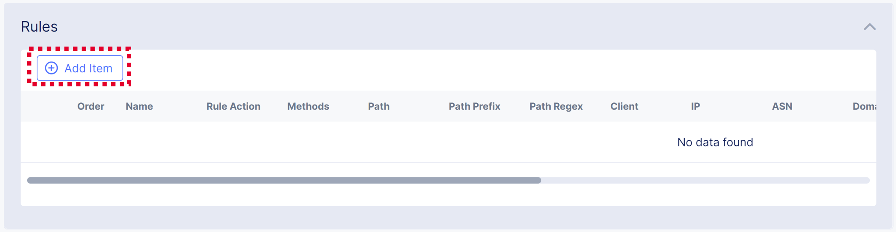

____

任意のNameを設定し、\ ``Configure`` \ を押下

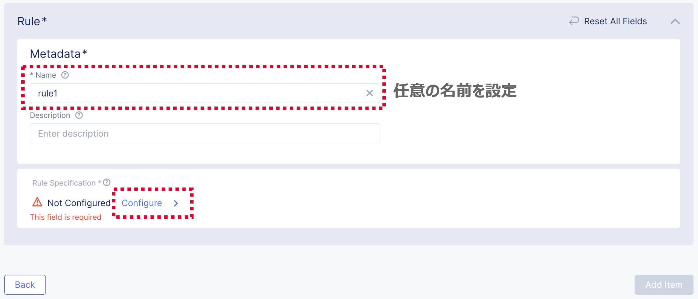

____

要件に応じてRuleを設定し、\ ``Apply`` \ を押下

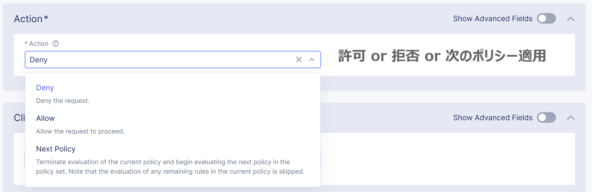

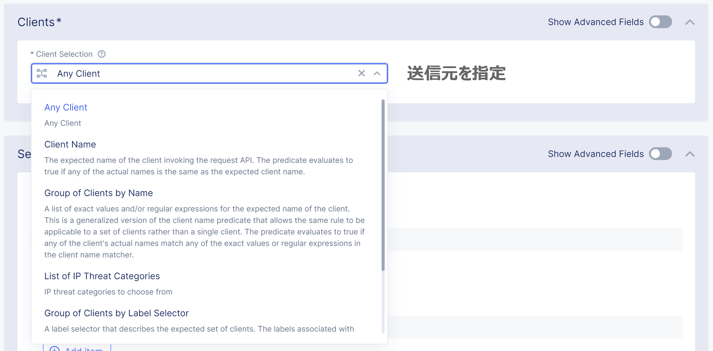

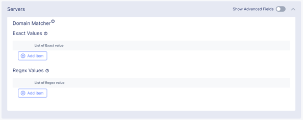

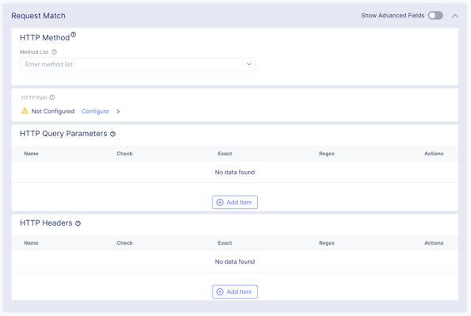

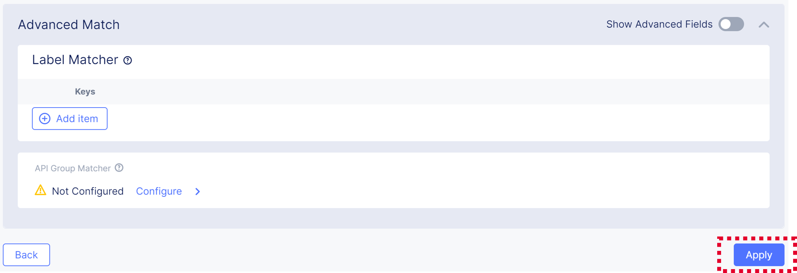

____

\ ``Add Item`` \ を押下

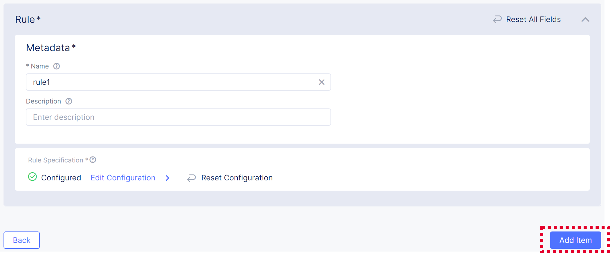

____

\ ``Apply`` \ を押下

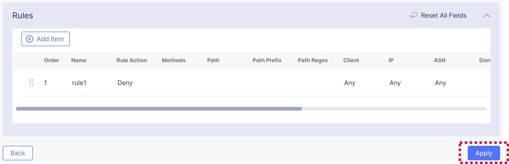

____

\ ``Save and Exit`` \ を押下

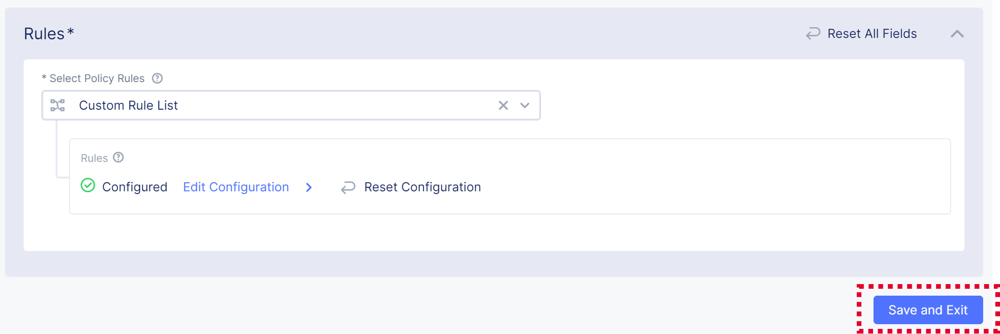

____

設定したService Policyが追加されていることを確認

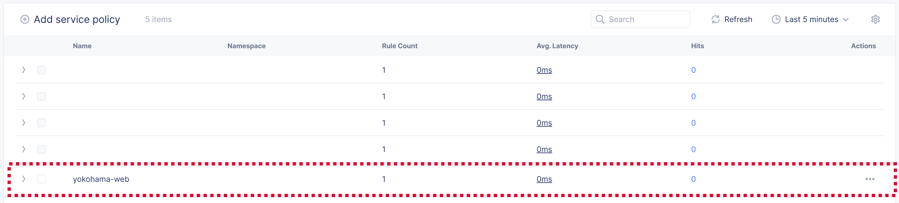

.. NOTE::
   | Service Policyを作成しただけでは、ポリシーは有効になりません。
   | ポリシーを有効にするには、次の手順にて、Service PolicyをActive化する必要があります。
   

Service PolicyをActiveにする
==================

**Manage** > **Service Policies** > **Active Policies** を選択

.. image:: ../content06/images/image-06-19.png
  :width: 320

____

\ ``Select Active Service Policies`` \ を押下

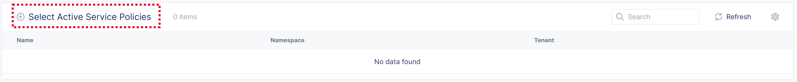

____

\ ``Select Service Policy`` \ を押下

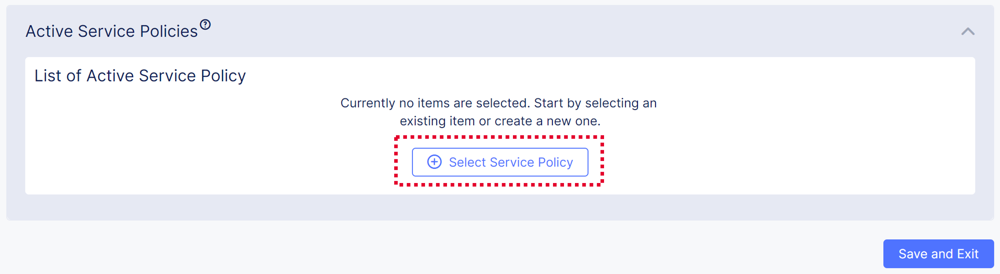

____

ActiveにしたいService Policyを選択し、\ ``Select Service Policy`` \ を押下

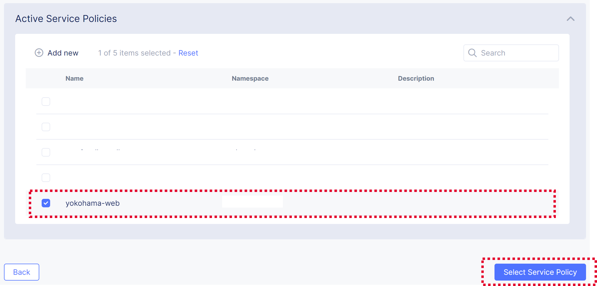

____

Service Policyがリストに追加されていることを確認し、\ ``Save and Exit`` \ を押下

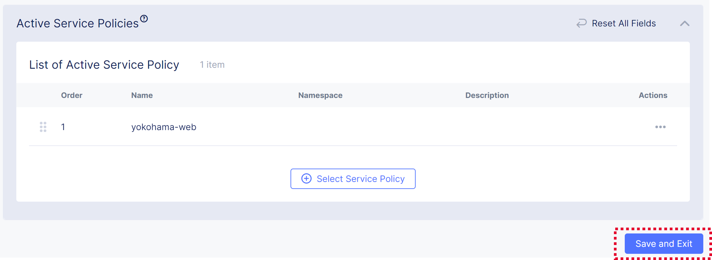

____

Active Service Policiesの一覧に表示されればOKです

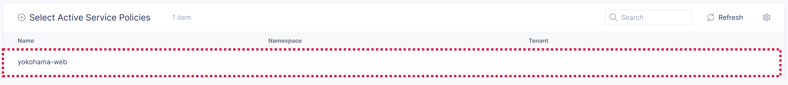

____

