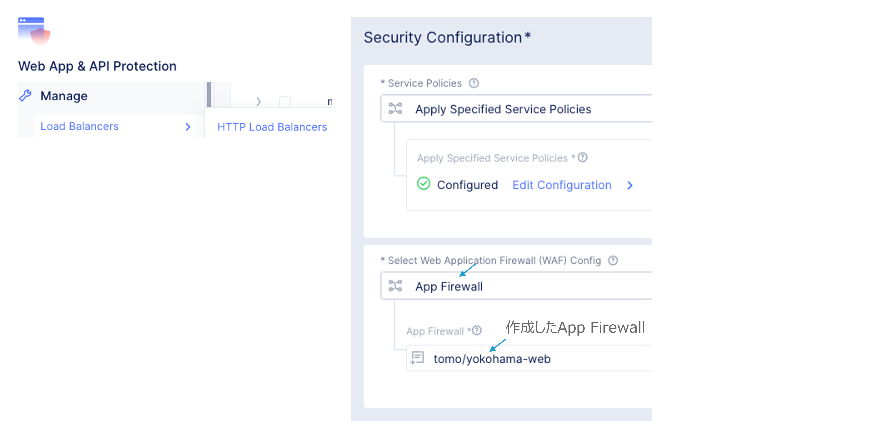
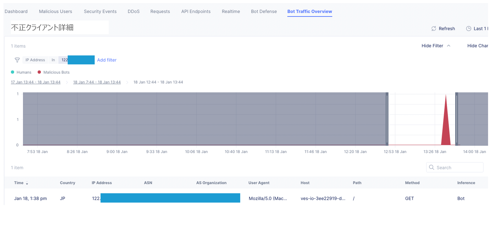

==============================================
WAF & Bot Protection
==============================================

WAF
==================

WAF：Webアプリケーションに対するシグネチャベースの攻撃検知。

WAF用語

+-----------------------------+-----------------------------------------------------------------------------+
|用語      　                 |説明                                                                          |
+=============================+=============================================================================+
|Attack Type                  |攻撃または攻撃のクラスを識別するルールまたはパターン。複数の攻撃シグネチャを持つ。  |
+-----------------------------+-----------------------------------------------------------------------------+
|Attack Signature             |攻撃シーケンスを識別するルールまたはパターン。HTTPリクエストとレスポンスに適用。   |
+-----------------------------+-----------------------------------------------------------------------------+
|Accuracy Level               |検知するシグネチャレベルを指定。Lowレベルまで指定すると誤検知が多くなる。          |
+-----------------------------+-----------------------------------------------------------------------------+
|False Positive Suppression   |機械学習により誤検知を抑制する機能。                                            |
+-----------------------------+-----------------------------------------------------------------------------+
|Threat Campaign Detection    |新たな脅威に対し即座にシグネチャを提供。                                        |
+-----------------------------+-----------------------------------------------------------------------------+
|Violation Detection          |HTTPヘッダーやJSONデータなど標準化された形式から逸脱したものを検知。              |
+-----------------------------+-----------------------------------------------------------------------------+

Bot Protection & Defense
==================

Bot Protection：BotやWebツール、ブラウザ等の不正な振る舞いを検知。

  
BOTの種類

+-----------------------------+-----------------------------------------------------------------------------+
|種類      　                 |説明                                                                          |
+=============================+---------------------------------============================================+
|Good Bot                 |既知の検索エンジンの振る舞いやシグネチャ  |
+-----------------------------+-----------------------------------------------------------------------------+
|Suspicious Bot             |悪意のないツールやBotの動作を示すもの。以下はSuspicious Botに分類される。Tools - Site crawlers, monitors, spiders, web downloaders. Bots - Social media agents, Search Bot。   |
+-----------------------------+-----------------------------------------------------------------------------+
|Malicious Bot               |Botシグネチャ、ブラウザ検証テスト、脆弱性スキャナー等で検知したもの。          |
+-----------------------------+-----------------------------------------------------------------------------+

Bot Defense：JSまたはSDKによりデータ収集、機械学習でリクエストが悪意のあるBotか判断。

App Firewall
==================

WAF、Bot Protection用にApp Firewallを作成。

____

App Firewall – WAF Custom
==================

App Firewall – Bot Protection
==================

.. image:: ../content09/images/image-09-07.png
  :width: 800

HTTP LoadBalancer
==================

App FirewallをHTTP LBで指定。

WAF イベント検知
==================

Bot Protection イベント検知
==================

Bot Defense
==================

Bot DefenseをLBで定義。

____

____

Bot Defense イベント検知
==================

____

 
  
  
  
  
  
