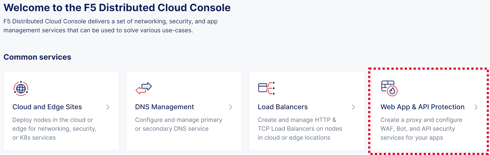
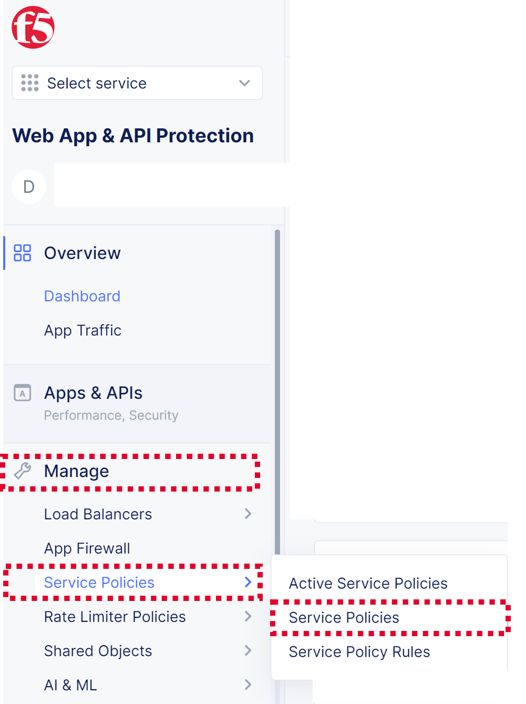
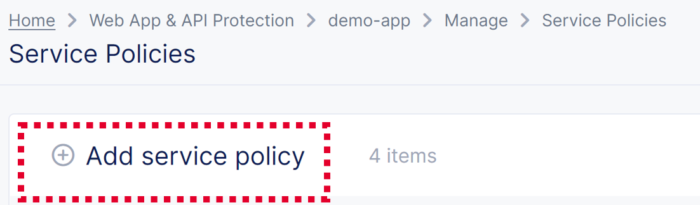
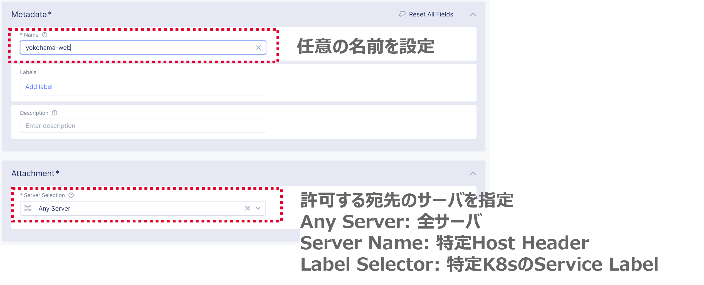
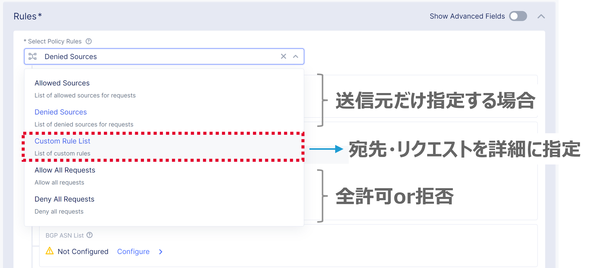
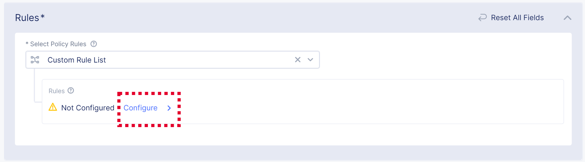

==============================================
Service Policy
==============================================

HTTP LBのVIPに対するL7アクセス制御
==================

送信元の指定

+---------------+--------------------------------------------+
|送信元         |説明                                        |
+===============+============================================+
|IPv4 Prefix    |指定のネットワークアドレスからのアクセス    |
+---------------+--------------------------------------------+
|BGP ASN        |特定のAS番号からのアクセス                  |
+---------------+--------------------------------------------+
|Country List   |特定の国を指定（実態はグローバルIPアドレス）|
+---------------+--------------------------------------------+

宛先・リクエストの指定

+-------+----------------------+--------------------------------------------+
|宛先 　|　                    |説明                                        |
+=======+======================+============================================+
|Server |Domain Matcher        |ドメイン名を指定。完全一致または正規表現。  |
+-------+----------------------+--------------------------------------------+
|Request|HTTP Method           |メソッドとHTTPパス。Get, Put, Post等。      |
+-------+----------------------+--------------------------------------------+
|       |HTTP Query Parameters |クエリ文字列。?query=udp等。                |
+-------+----------------------+--------------------------------------------+
|       |HTTP Headers          |ヘッダ。User-Agent: Mozilla/4.0等。         |
+-------+----------------------+--------------------------------------------+
|       |Cookie Matcher        |Session-id=12345等                          |
+-------+----------------------+--------------------------------------------+
|       |Body Matcher          |Request Body String。                       |
+-------+----------------------+--------------------------------------------+

.. image:: ../content1/image-06-01.png
  :width: 640
  
  
Service PolicyでRuleを定義
==================

[Web App & API Protection] を選択

***
---
___

**Manage** → ___Service Policies___ → [Service Policies] を選択

選択

選択

選択

\ ``Add service policy`` \ を押下

設定内容の入力

  

[Configure] を押下

~
